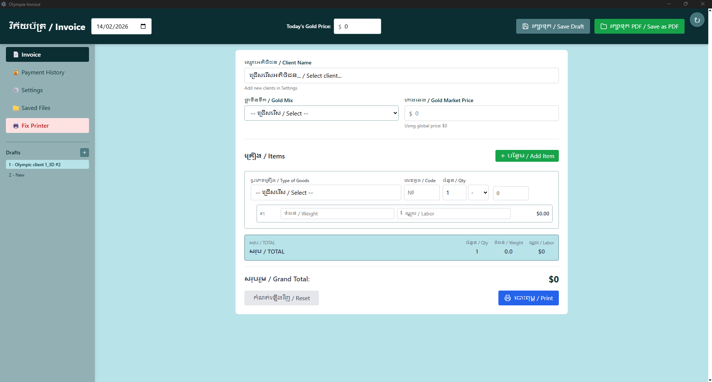
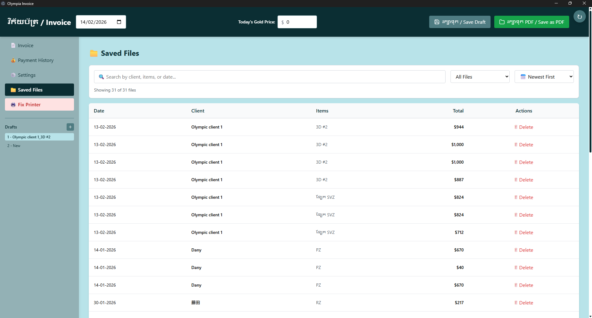
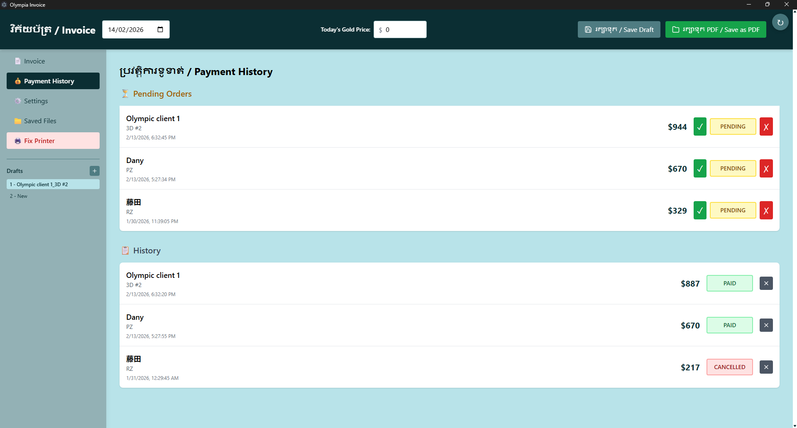
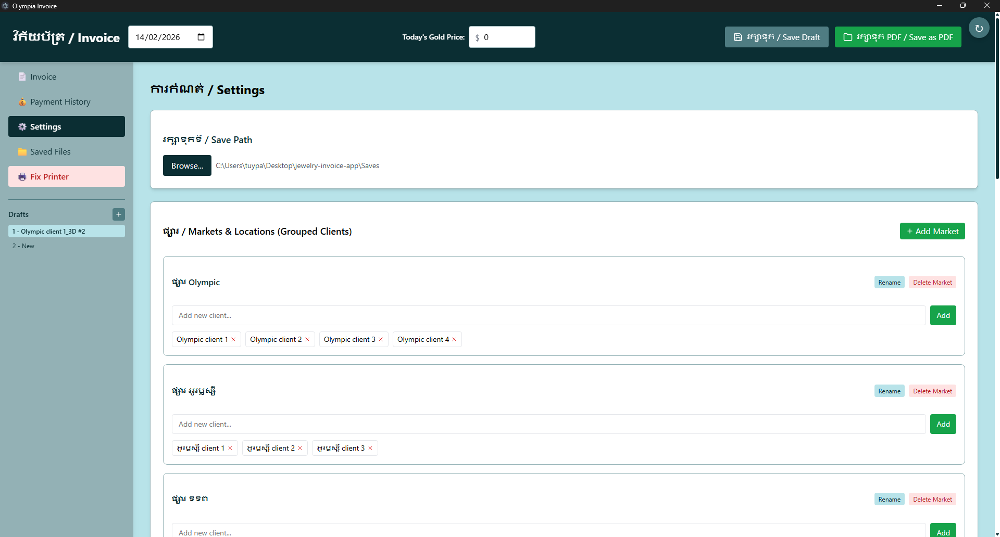

# 📄 Olympia Invoice - Jewelry Invoice Management System

A professional desktop application for managing jewelry invoices in Cambodia, built with Electron and React. Designed specifically for jewelry businesses that need bilingual (Khmer-English) invoicing with custom gold pricing calculations.


---

## 📸 Screenshots

### Main Invoice View

*Create invoices with bilingual support, custom gold pricing, and multi-item management*

### Saved Files Browser

*Search, filter, and preview all saved invoices with embedded preview*

### Payment History

*Track payments with detailed status and outstanding balances*

### Settings & Configuration

*Configure save paths, manage clients, and customize product types*

---

## ✨ Features

### 💎 **Invoice Management**
- **Bilingual Interface** - Full Khmer and English support
- **Custom Gold Pricing** - Variable gold percentages (75%, 80%, 90%, 100%) with real-time market price
- **Complex Calculations** - Automatic weight-based pricing with custom rounding rules
- **Multi-Item Support** - Handle multiple jewelry pieces in a single invoice
- **Draft System** - Save multiple invoice drafts and switch between them instantly
- **Payment Tracking** - Record partial payments and track outstanding balances

### 🗂️ **File Management**
- **Smart Organization** - Automatically organizes invoices by client name
- **Dual Format Saving** - Saves both HTML (for preview) and PDF (for printing)
- **File Browser** - Built-in browser to view, search, and manage saved invoices
- **Advanced Search** - Filter by client, date, items, or total amount
- **Embedded Preview** - View invoices directly in the app without opening external programs

### 🎨 **Professional Output**
- **Print-Ready PDFs** - High-quality A4-sized invoices
- **QR Code Integration** - Automatic payment QR codes for ABA Pay and Wing
- **Custom Branding** - Includes business logo and contact information
- **Khmer Typography** - Proper font rendering for Khmer language

### ⚙️ **Business Features**
- **Client Grouping** - Organize clients by market or category
- **Product Types** - Categorized jewelry types (rings, necklaces, bracelets, etc.)
- **Payment History** - Track all transactions with date, amount, and method
- **Settings Management** - Configure save paths, default values, and preferences
- **Offline First** - Works completely offline, no internet required

---

## 🚀 Getting Started

### **Prerequisites**
- Node.js 16+ and npm
- Windows 10/11 (primary platform)

### **Installation**

1. **Clone the repository:**
   ```bash
   git clone https://github.com/Pascaruuu/Jewelry-Invoice.git
   cd Jewelry-Invoice
   ```

2. **Install dependencies:**
   ```bash
   npm install
   ```

3. **Run in development mode:**
   ```bash
   npm start
   ```

4. **Build for production:**
   ```bash
   npm run build
   ```

---

## 📖 Usage

### **Creating an Invoice**

1. **Set Gold Price** - Enter today's gold market price in the header
2. **Select Client** - Choose existing client or add new one
3. **Add Items** - Select product type, enter weight and quantity
4. **Review Calculations** - Check automatic price calculations with gold percentage
5. **Save Draft** - Save work in progress
6. **Generate PDF** - Save final invoice as PDF when ready

### **Managing Saved Files**

1. **Navigate to Saved Files** - Click 📁 Saved Files in sidebar
2. **Search & Filter** - Use search bar or filter by date
3. **Preview Invoice** - Double-click any row to see full preview
4. **Open in Browser** - Print or save from browser
5. **Delete Files** - Remove unwanted invoices with confirmation

### **Payment Tracking**

1. **Go to Payment History** - Track all client payments
2. **Record Payment** - Enter date, amount, and method
3. **View Status** - See PAID, PENDING, or CANCELLED invoices
4. **Outstanding Balance** - Automatic calculation of remaining amount

---

## 🛠️ Technology Stack

- **Framework:** Electron (Desktop App)
- **Frontend:** React 18 (with Babel for JSX)
- **Styling:** Tailwind CSS (Custom build)
- **File Operations:** Node.js fs/path modules
- **PDF Generation:** Native Electron printing
- **Data Storage:** LocalStorage + File system

---

## 📁 Project Structure

```
jewelry-invoice-app/
├── index.html              # Main application entry
├── App.js                  # React app root component
├── main.js                 # Electron main process
├── package.json            # Dependencies and scripts
├── components/             # React components
│   ├── Header.js
│   ├── Sidebar.js
│   ├── GroupedTypeSelector.js
│   ├── GroupedClientSelector.js
│   ├── InputModal.js
│   ├── CustomPopup.js
│   └── Icons.js
├── pages/                  # Page components
│   ├── InvoicePage.js
│   ├── PaymentHistoryPage.js
│   ├── SettingsPage.js
│   ├── SavedFilesPage.js
│   └── PrintView.js
├── utils/                  # Utility functions
│   ├── calculations.js
│   ├── storage.js
│   ├── groupManagement.js
│   └── fileOperations.js
├── libs/                   # Offline libraries
│   ├── react.production.min.js
│   ├── react-dom.production.min.js
│   ├── babel.min.js
│   └── tailwind.min.css
└── assets/                 # Images and resources
    └── screenshots/        # Application screenshots
```

---

## 🎨 Customization

### **Colors & Theme**

Edit the theme colors in `index.html`:

```css
:root {
  --primary: #0B2E33;    /* Dark teal */
  --secondary: #4F7C82;  /* Medium teal */
  --tertiary: #93B1B5;   /* Light teal */
  --accent: #B8E3E9;     /* Pale teal */
}
```

### **Business Information**

Update your business details in the invoice template:
- Company name
- Contact information
- Payment QR codes
- Logo image

### **Product Categories**

Modify product types and client groups in the Settings page or directly in `utils/storage.js`.

---

## 🔧 Configuration

### **Initial Setup**

1. **Set Save Path** - Go to Settings → Select folder for saving invoices
2. **Configure Gold Price** - Set default gold market price
3. **Add Clients** - Create client list with grouping
4. **Add Product Types** - Define jewelry categories

### **File Organization**

Invoices are automatically saved with this structure:
```
Saves/
├── Client A/
│   ├── 14-02-2026_Client A_Ring_10h30.html
│   └── 14-02-2026_Client A_Ring_10h30.pdf
└── Client B/
    └── 13-02-2026_Client B_Necklace_15h45.html
```

---

## 💡 Key Features Explained

### **Gold Pricing System**
- Supports 75%, 80%, 90%, and 100% gold purity
- Real-time calculation based on weight and market price
- Custom rounding rules for local market standards

### **Draft Management**
- Save unlimited invoice drafts
- Switch between drafts instantly
- Each draft maintains its own state
- Auto-save functionality

### **Payment Tracking**
- Multiple payment methods (Cash, Card, Bank Transfer, Wing, ABA)
- Partial payment support
- Automatic status updates (PAID/PENDING/CANCELLED)
- Outstanding balance calculation

### **Search & Filter**
- Full-text search across clients, items, dates
- Date range filtering (Yesterday, This Week, This Month)
- Sort by date, total, or client name
- Real-time results

---

## 🐛 Troubleshooting

### **Printing Issues**

If printing doesn't work:
1. Click "🖨️ Fix Printer" in sidebar
2. Restart Windows print spooler
3. Try printing again

### **Files Not Loading**

If saved files browser is empty:
1. Check Settings → Verify save path is set
2. Ensure invoices are saved in the correct folder
3. Click "🔄 Refresh" button

### **Preview Not Showing**

If invoice preview is blank:
1. Make sure file is HTML format (not PDF)
2. Check that `webSecurity: false` is set in main.js
3. Verify file path has no special characters issues

---

## 🤝 Contributing

Contributions are welcome! Please feel free to submit a Pull Request.

1. Fork the project
2. Create your feature branch (`git checkout -b feature/AmazingFeature`)
3. Commit your changes (`git commit -m 'Add some AmazingFeature'`)
4. Push to the branch (`git push origin feature/AmazingFeature`)
5. Open a Pull Request

---

## 👨‍💻 Author

**Pascal** - *Full-Stack Developer & UI/UX Designer*

- Portfolio: [pascaruuu.github.io/Portfolio](https://pascaruuu.github.io/Portfolio/)
- GitHub: [@Pascaruuu](https://github.com/Pascaruuu)
- Project: [Jewelry-Invoice](https://github.com/Pascaruuu/Jewelry-Invoice)